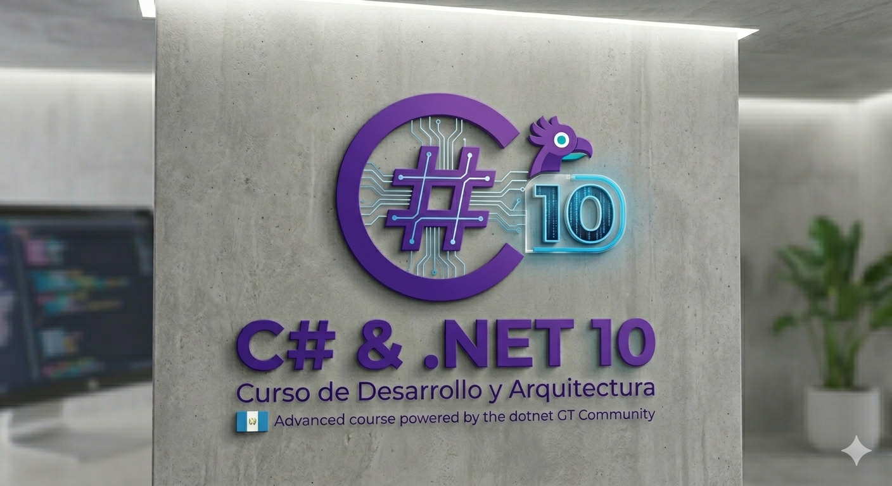

# Curso de C# y .NET 10

Repositorio base del curso **C# y .NET 10: de los fundamentos al nivel intermedio**, con foco en el aprendizaje progresivo del desarrollo web con **ASP.NET**.

La idea de este repositorio es organizar el contenido por sesiones, de forma que cada carpeta represente una clase, práctica o bloque temático del curso.

## Objetivo del curso

Durante el curso se trabajará sobre los fundamentos de C#, el ecosistema de .NET 10 y la evolución hacia la construcción de aplicaciones web con ASP.NET.

Entre los temas que este repositorio irá cubriendo se encuentran:

- Sintaxis y fundamentos de C#
- Tipos, variables, condicionales y ciclos
- Métodos, clases y principios de programación orientada a objetos
- Estructura de proyectos en .NET 10
- Introducción al desarrollo web con ASP.NET
- Construcción progresiva de aplicaciones y ejercicios prácticos

## Requisitos recomendados

- .NET 10 SDK
- Visual Studio Code o Visual Studio
- Extensión C# para VS Code
- Git

## Estructura del repositorio

```text
curso-csharp-dotnet-2026/
├── img/
├── sesion1/
│   └── MiPrimeraApp/
├── sesion2/
│   └── ejemplo1/
├── sesion3/
│   ├── Sesion 3.json
│   └── ejemplo1/
├── sesion4/
│   └── TiendaWeb.Mvc/
└── README.md
```

## Sesiones disponibles

| Sesion | Contenido | Acceso |
| --- | --- | --- |
| Sesion 1 | Primera aplicación en .NET 10, estructura básica de proyecto y punto de partida del curso | [sesion1/MiPrimeraApp](./sesion1/MiPrimeraApp/) |
| Sesion 2 | Introducción a ASP.NET: Minimal APIs (endpoints con `MapGet`), controladores estilo MVC (`ProductosController`) y uso básico de logging (`ILogger`) | [sesion2/ejemplo1](./sesion2/ejemplo1/) |
| Sesion 3 | ASP.NET con Entity Framework Core: configuración de `DbContext`, base de datos en memoria (`UseInMemoryDatabase`) y CRUD completo de productos (GET, GET por id, POST, PUT, DELETE) | [sesion3/ejemplo1](./sesion3/ejemplo1/) |
| Sesion 4 | ASP.NET Core MVC con vistas Razor: aplicación `TiendaWeb.Mvc`, `AppDbContext` con EF Core en memoria y CRUD web para Productos y Estudiantes | [sesion4/TiendaWeb.Mvc](./sesion4/TiendaWeb.Mvc/) |

## Ejemplos incorporados recientemente

- **Persistencia con EF Core en memoria**: configuración de `AppDbContext` y registro con `AddDbContext`.
- **Datos semilla**: carga inicial de productos al iniciar la aplicación.
- **API CRUD completa**: operaciones para listar, crear, actualizar y eliminar productos.
- **Validación y respuestas HTTP apropiadas**: uso de `Ok`, `CreatedAtAction`, `NoContent` y `NotFound`.
- **Aplicación MVC con Razor**: rutas por controlador/acción y páginas para listar, crear, editar, ver detalle y eliminar registros.
- **Gestión de dos entidades**: mantenimiento de Productos y Estudiantes con controladores y vistas independientes.

## Cómo ejecutar cada sesión

1. Abre una terminal en la carpeta de la sesión que quieras ejecutar.
2. Restaura y ejecuta el proyecto:

```bash
dotnet restore
dotnet run
```

3. En proyectos web, abre en el navegador la URL mostrada en la salida de la consola.

## Últimos cambios del repositorio

- Se agregó la carpeta **sesion4/TiendaWeb.Mvc** con una aplicación MVC completa.
- Se incorporaron controladores y vistas para **Productos** y **Estudiantes**.
- Se mantiene el uso de **EF Core InMemory** para facilitar las prácticas sin configuración adicional de base de datos.